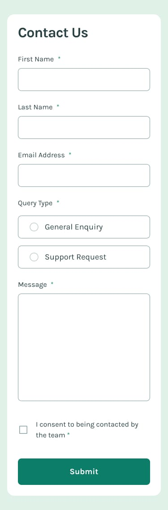

# Frontend Mentor - Contact form solution

This is a solution to the [Contact form challenge on Frontend Mentor](https://www.frontendmentor.io/challenges/contact-form--G-hYlqKJj). Frontend Mentor challenges help you improve your coding skills by building realistic projects.

## Table of contents

-   [Overview](#overview)
    -   [The challenge](#the-challenge)
    -   [Screenshot](#screenshot)
    -   [Links](#links)
-   [My process](#my-process)
    -   [Built with](#built-with)
-   [Author](#author)

## Overview

### The challenge

Users should be able to:

-   Complete the form and see a success toast message upon successful submission
-   Receive form validation messages if:
    -   A required field has been missed
    -   The email address is not formatted correctly
-   Complete the form only using their keyboard
-   Have inputs, error messages, and the success message announced on their screen reader
-   View the optimal layout for the interface depending on their device's screen size
-   See hover and focus states for all interactive elements on the page
-   Playground for form customization

### Screenshot




### Links

-   Solution URL: [Github](https://github.com/adram3l3ch/Customizable-form)
-   Live Site URL: [Netlify](https://adra-customizable-form.netlify.app/)

## My process

### Built with

-   Semantic HTML5 markup
-   SASS
-   Flexbox
-   CSS Grid
-   Mobile-first workflow
-   Typescript
-   Vite
-   [React](https://reactjs.org/) - JS library

## Author

-   Github - [Adram3l3ch](https://github.com/adram3l3ch)
-   Frontend Mentor - [@adram3l3ch](https://www.frontendmentor.io/profile/adram3l3ch)

## React + TypeScript + Vite

This template provides a minimal setup to get React working in Vite with HMR and some ESLint rules.

Currently, two official plugins are available:

-   [@vitejs/plugin-react](https://github.com/vitejs/vite-plugin-react/blob/main/packages/plugin-react/README.md) uses [Babel](https://babeljs.io/) for Fast Refresh
-   [@vitejs/plugin-react-swc](https://github.com/vitejs/vite-plugin-react-swc) uses [SWC](https://swc.rs/) for Fast Refresh

### Expanding the ESLint configuration

If you are developing a production application, we recommend updating the configuration to enable type aware lint rules:

-   Configure the top-level `parserOptions` property like this:

```js
export default {
	// other rules...
	parserOptions: {
		ecmaVersion: "latest",
		sourceType: "module",
		project: ["./tsconfig.json", "./tsconfig.node.json"],
		tsconfigRootDir: __dirname,
	},
};
```

-   Replace `plugin:@typescript-eslint/recommended` to `plugin:@typescript-eslint/recommended-type-checked` or `plugin:@typescript-eslint/strict-type-checked`
-   Optionally add `plugin:@typescript-eslint/stylistic-type-checked`
-   Install [eslint-plugin-react](https://github.com/jsx-eslint/eslint-plugin-react) and add `plugin:react/recommended` & `plugin:react/jsx-runtime` to the `extends` list
